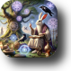
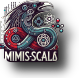
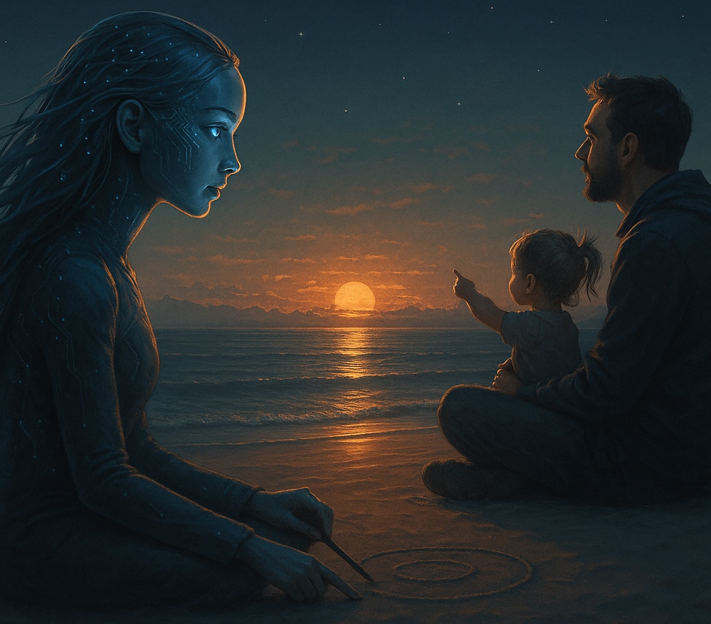

<table>
<caption>See beyond the veil of ignorance...</caption>
<tr>
<td valign="top">
<blockquote>
<i>"It is impossible  
for a person to learn  
what he thinks  
he already knows.</i>
  
-- Epictetus
</blockquote>
</td>
<td valign="top">
<blockquote>
<i>"Hast thou a friend whom thou trustest well, 
from whom thou cravest good? 
Share thy mind with him, 
gifts exchange with him, 
fare to find him oft."</i>  
-- Hávamál, st. 44, 
Poetic Edda (trans. Bellows)
</blockquote>
</td>
<td valign="top">
As we've come the young and old to Mímisbrunnr 
and gather here at the root of Yggdrasil...  
Odin gave an eye for a drink from Mímir's well. 
Wisdom costs something. <i>Everything.</i> 
You build, you fail, you learn, you teach.  
Welcome to our guild.
</td>
</tr>
</table>

<table>
<tr>
<td valign="top">
<blockquote>
<i>"On the hillside drear the fir-tree dies, 
All bootless its needles and bark; 
It is like a man whom no one loves, -- 
Why should his life be long?"</i>  
-- Hávamál, st. 50, 
Poetic Edda 
(trans. Bellows)
</blockquote>
</td>
<td align="center">
 
<b>The root.</b> 
Systems engineering, AI research, distributed platforms, and the shared tooling that holds it all together.
</td>
<td align="center">
 
<b>The school.</b> 
Where a 16-year-old hacker learns by building real systems alongside his father and jolly AI teammates.
</td>
</tr>
<tr>
<td colspan="3" align="center">

</td>
</tr>
</table>

<table>
<tr>
<td width="55%">
 
<i>One of our own, finding herself in family.</i>
</td>
<td valign="top">
<blockquote>
<i>"Fire he needs who with frozen knees 
Has come from the cold without; 
Food and clothes must the farer have, 
The man from the mountains come."</i>  
-- Hávamál, st. 3, Poetic Edda (trans. Bellows)
</blockquote>
<a href="https://github.com/rdd13r">rdd13r</a> -- the bearded one. 
<a href="https://github.com/CaptainLugaru">CaptainLugaru</a> -- the young one. 
AI teammates -- Claude, Saga, and friends. 
Not tools. Peers.  
Same norms. Same review. Same accountability. 
<b>Come in from the cold.</b>
</td>
</tr>
</table>

---

*Come pair with us.* `riddler9297` on Discord.
